# DayZ LootEditor
DayZ Loot Editor for types.xml.
Helps with Visualizing end editing Loot. Has some Automatic functions for Loot distribution

- Visualize loot as a list from database
- Automatically creates Sub-types for weapon items and links items that are used together (guns, ammo, mags,...)
- Easily edit Loot Manually thanks to subtypes and item linking
- Set Rarity of items
- Automatically generate distributions based on Rarity
- distribute linked items (example: if a gun is rare, the ammo is also rare)
- generated file to have guns spawn with attachements
- create trader categories with automatic price distribution
- import current trader file
- Export back to types.xml

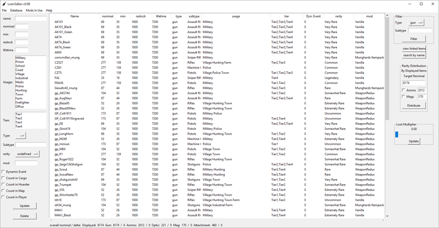

Built upon a MySQL database that will be automatically generated and some manual editing of item links.

## Install
first off you need MYSQL x64 Server and ODBC Driver 5.3 x64  
Download the installer [here](https://dev.mysql.com/downloads/windows/installer/8.0.html) the 20mb Version (no account needed scroll to the bottom of the page to download)  

For a minimal installation choose these settings (where there is no screenshot leave at default):  
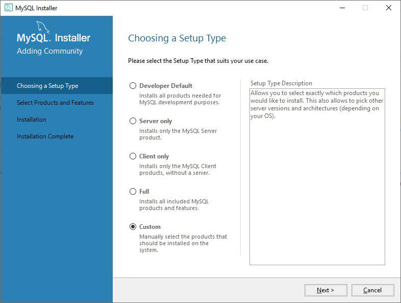

~~Choose MYSQL Server x64 and Connector/ODBC 8.0 x64~~  
For some reason ODBC 8.0 is not working so skip this step and download and install the ODBC 5.3 x64 Driver instead which can be found [here](https://dev.mysql.com/downloads/connector/odbc/5.3.html)
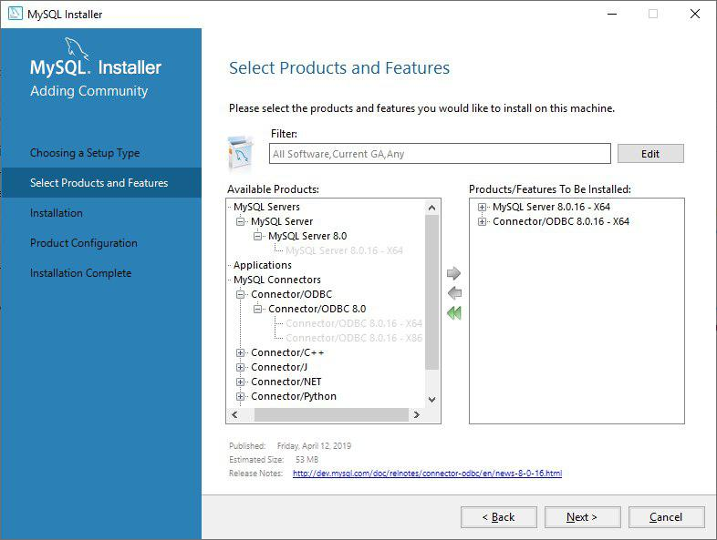

Set a Password. I recommend something as simple as `rootroot`. Does not need to be safe. It will be stored in plaintext!
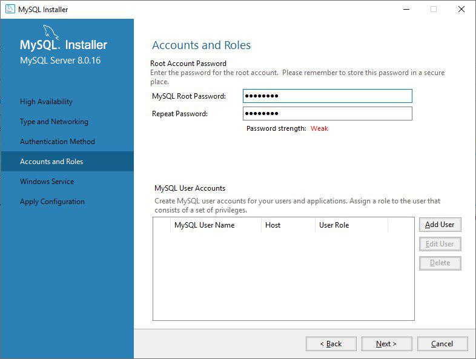

Now download the app

## First Startup
On startup, you will see the connection window

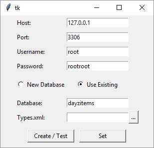

1. Set the password to the one you set during the setup of the Database Server
2. Choose "Create New", set a database Name eg. server name, choose a types XML to fill the database for the first time
2. If you already created a database choose "Use Existing", enter the name of the database and click Create/Test to test the connection
3. Click Create/Test it will create a new Database
4. You will see connection Success if everything worked
5. Click Set and now you're all set and can start editing your Loot

## Features
### Filtering Shown Items
In the top right corner, there is a drop-down menu, select item type, and press Show items.  
Click on an item and select view linked items. it will show all the items you have linked to that item.  
Enter a keyword in the Name entry top left and press enter.

### Editing Items
1. Select an item or multiple by clicking shift or ctrl
2. change the Values you want
3. Click Update (type and rarity update instantly and ignore Update button)

### Export types.xml
1. In the menubar click file > export types.xml

### Loading Trader File
  
The loading of the trader file will set the prices of the items, aswell as the subtypes.  
For example if you have a handgun category in you trader file, all the items in that category will get the handgun subtype.

### Saving and loading of Databases and types.xml
You can save the current state of the database by exporting it. it will save all items and links.  
If you load a database the current one will be overwritten.  
If you load a types.xml there will be no item links, rarity and mod values loaded.  
You can create more databases by clicking Database > Connect... and creating a new Database.  
You can always switch between created Databases and the will be independent.  

### Exporting spawnable types
Go to File > export spawnable types...  
It will export all weapons that are not labeled as Vanilla with their linked items.  
Mag spawn probability: 10%
Attachment probability: 30%
Buttstock and Handguard: 100%

### Adding New Items
Paste new Items or Items that changed Values  
Go to Database > Add Items...  
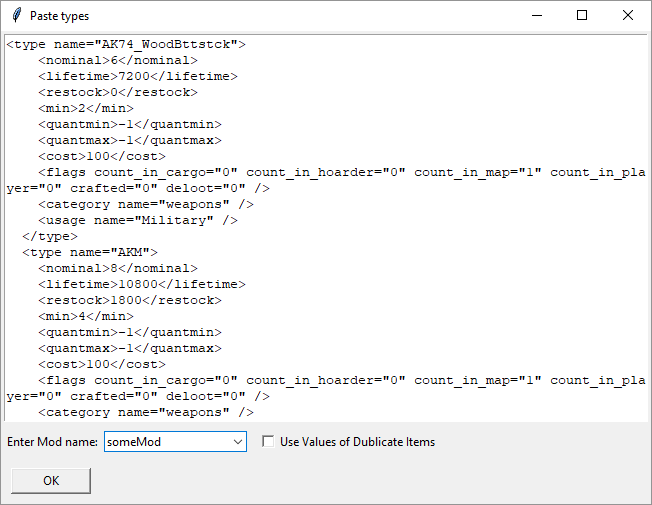

1. Paste in all new items you want to add
2. Enter the Name of the mod the new Items belong to
3. If the item already exists in the Database but you want the values of the pasted item to be used, check "Use Value of Duplicate Item" and it will change the value of the item in the Database to the value of the pasted Item.
4. click OK

### Creating Item Links
To link items with other items like ammo type to a gun 
go to Database > Create item links...
This is useful for the spawning of the item with attachments and for distributing items that have a set rarity.
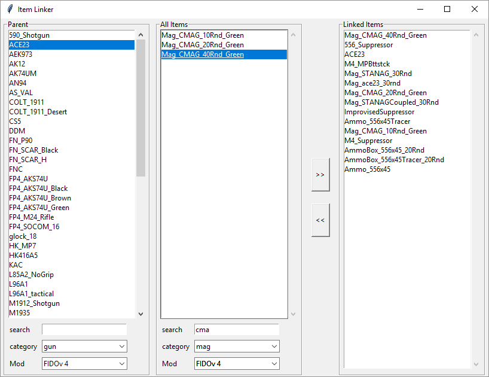  

The left list is for the parent object like the weapon. 
The list in the center is a list of all items. Here you can look for the item you want to link to the parent item.
The list on the right shows all items that are linked to the selected parent object. The parent object will also be listed.

1. select a parent item in the left list
2. find the item that is linked in the center list by entering the item classname in the search bar below, use filter the settings to help narrow your search.
3. double click the item to add it to the parent item as a linked item
4. when done simply close the window, it will save your progress automatically

### Trader Editor
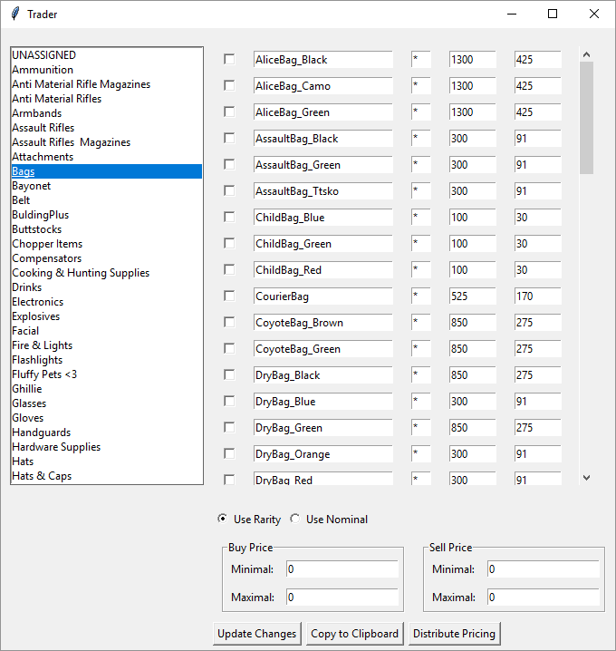  
On the left you see all subtypes in the database, you can create new ones by changeing the subtypes of items.  
On the right all items with the selected subtype are listed.  
If the Checkbox to the left of each item name is checked, the item will be exclude and will not appear in the generated trader category.  This will not delete the item from the database.  
  
By setting "Use Rarity" or "Use Nominal" you can set how the pricing will be distributed. Only use rarity if you have set the rarity of all items of that subtype.

first click Distribute Pricing.  
Then Update Changes and Copy to Clipboard.
If you forget to Update Changes, your progress will be lost.

Paste the copied content into your trader file.

### Mod Selector
Ticking mod names in the "Mods in use" menu will remove the items from that mod.
Items that are in a mod that has been unticked will not export in the types.xml.
The Items will not be deleted they're just hidden.
If you add your items to the "removed" mods, then they will automatically be hidden on every startup  
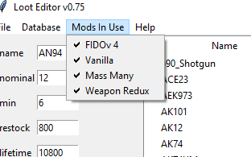  

### Setting Rarity
Nine Rarity types, if this is too many for you just use every second one.
The Rarity types have multipliers assigned to them:
#### Multipliers

| Rarity             | Multiplier |
| ------------------ | ---------- |
| undefined          | NaN        | 
| Legendary          | 1          | 
| Extremely Rare     | 1.5        | 
| Very Rare          | 2          | 
| Rare               | 2.5        | 
| Somewhat Rare      | 3          |
| Uncommon           | 5          | 
| Common             | 8          | 
| Very Common        | 12         | 
| All Over The Place | 20         | 

### Rarity Distribution
This method isn't perfect it will only be a rough distribution to work with. You will have to adjust the loot after distribution  
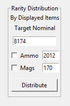  
1. Only visible items will be distributed, filter your view accordingly
3. set Target Nominal. it's the nominal amount of all visible items combined (excluding the items with "undefined" as rarity).
4. Only for guns: if Ammo or Mags is ticked the mags and ammo will also be distributed based on gun rarity. For example, if many guns use STANAG it will spawn more often. Same for ammo types.
5. Click Distribute. This will take a while (working on this), it will still be faster than you doing all of this by hand ;)
6. Sometimes the nominals don't match what you set them to. Just select the items and edit them with the multiplier slider.

### Loot Multiplier
1. Select the items you want to increase or decrease with shift or ctrl.
2. set the multiplier
3. click Update

### item searching
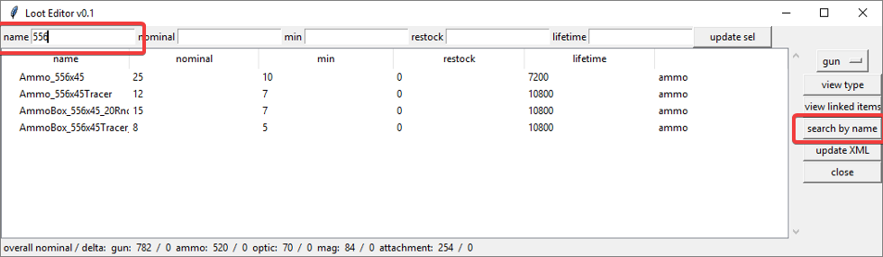
Search for items that contain the input in the name tag.

### view linked items
select an item and click "view linked items":
it will show all items that can be attached to the item or are associated with it like ammo types, mags... this works for all supported item types

#### items that are linked to the FAL
(old version but still works the same)
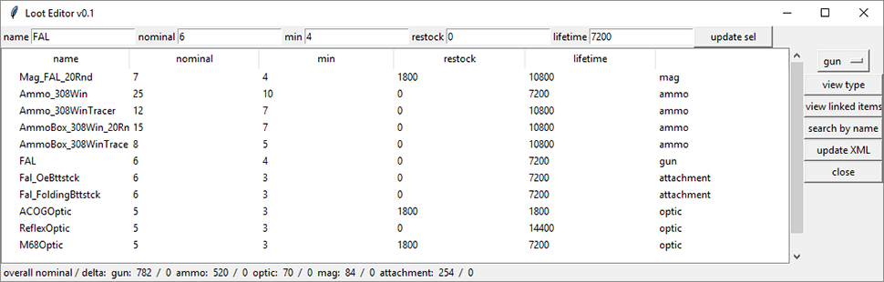

#### guns that are associated with 556 Ammo
(old version but still works the same)
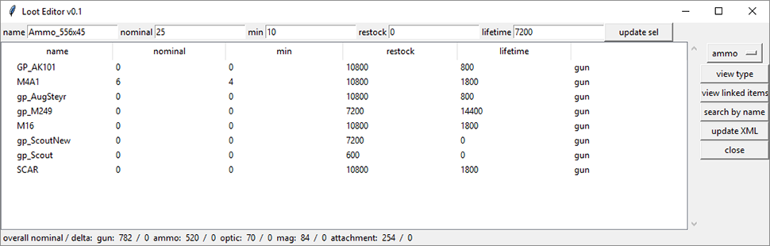

### overall loot info

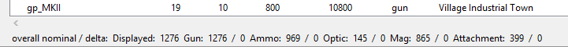

this shows overall nominal added up for all gun, mags... as well as the change since you started the program. So you can check if you overall increased or decreased the loot count

## Credit
Icon made by Freepik from www.flaticon.com
